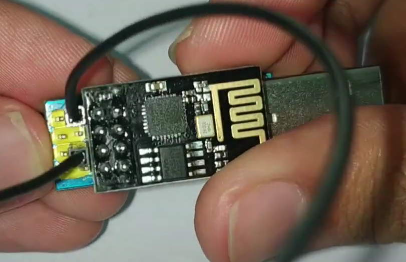
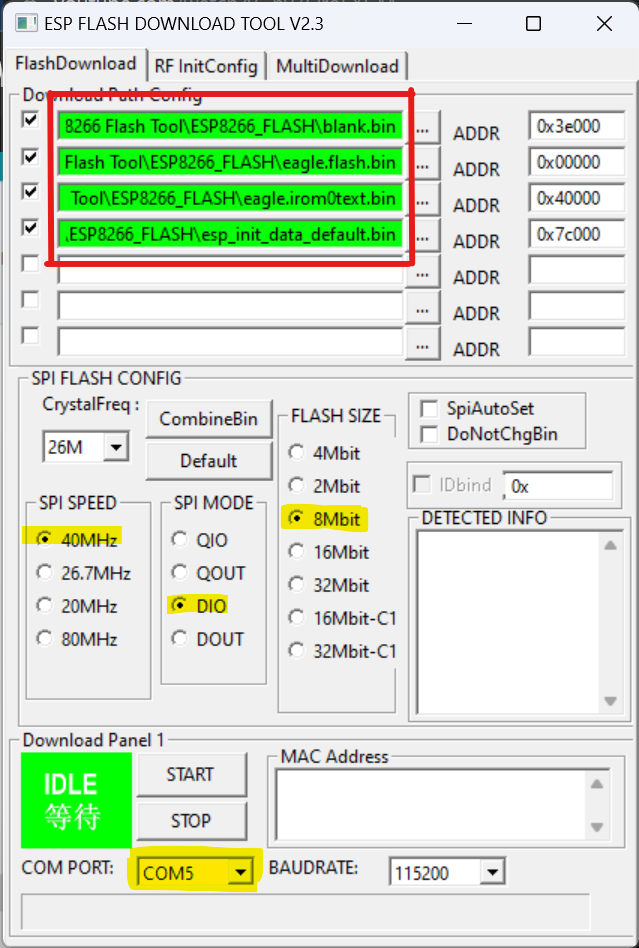
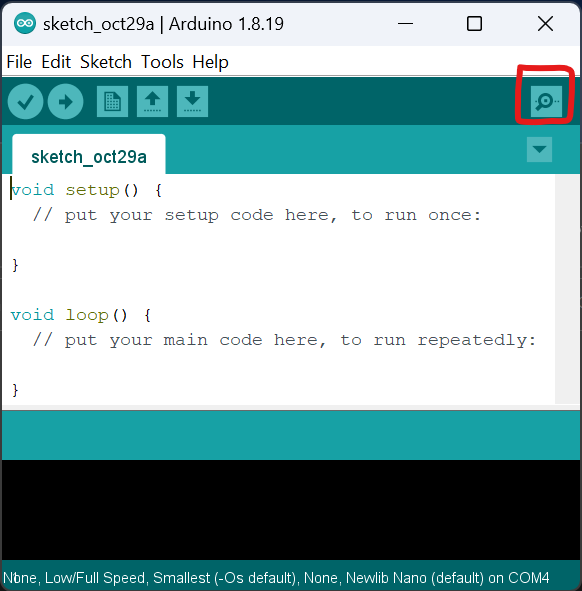
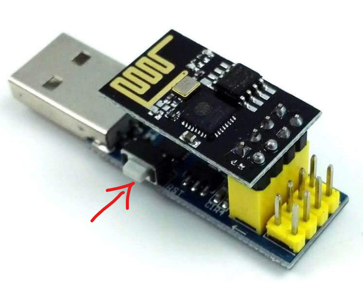
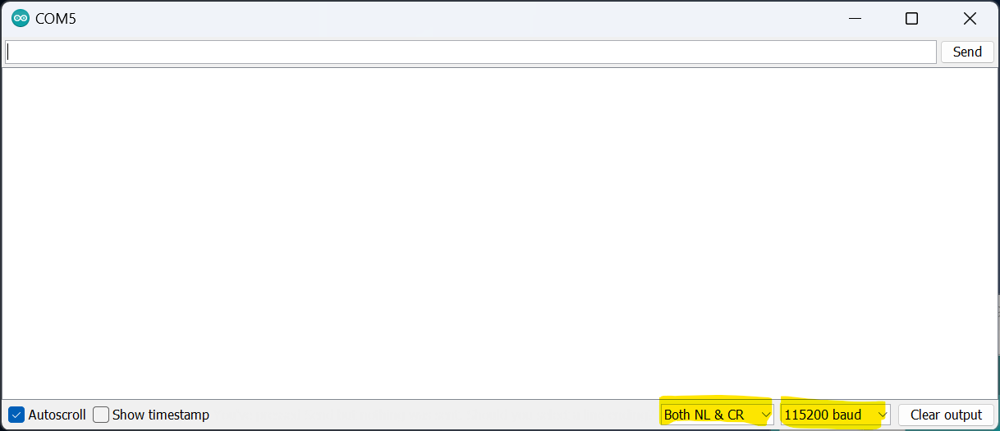
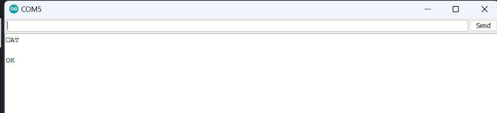
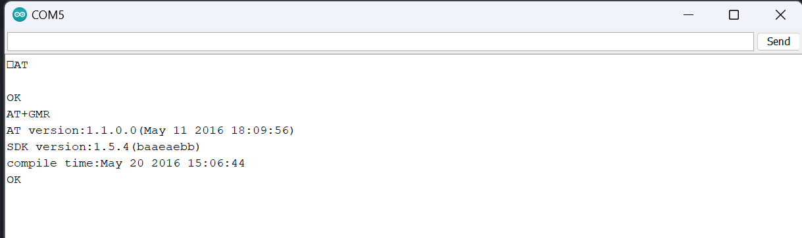
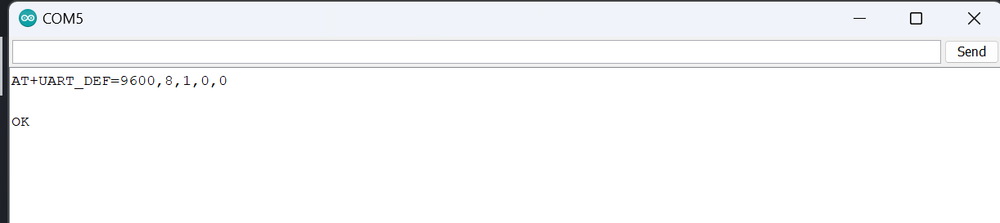

# ESP01 Flashing Procedures 
## Requirements
### Hardware
1. ESP01 Programmer Adapter. Available at [Cytron.io](https://my.cytron.io/p-esp01-usb-programmer-adapter).
2. ESP-01 WiFi Serial Transceiver Module. Available at [Cytron.io](https://my.cytron.io/p-esp-01-wifi-serial-transceiver-module-esp8266).
3. 1x Female-to-Female jumper wire
   
### Software
1. ESP8266 Flash Tools. Download zip file at [Flash_Tools folder](./flash_tools/ESP8266_%20Flash_Tool.zip).
2. Arduino IDE or other Serial Monitor software.

## Steps
1. Connect the ESP8266 to the Programmer Adapter
2. Connect the pin IO0 to GND using the jumper wire
   
    
    
3. Extract the ESP8266 Flash Tools.
4. Go to folder "FLASH_TOOL" and click the "ESP_DOWNLOAD_TOOL_V2.4.exe"
5. Change the settings according to the picture.
      

    

    > Change the COM port accoding to your board connection. You can check from computer "Device Manager".

    > The file can be accessed from the flash tool folder

6. Press **START**. The board is being programmed. Close the tool when finished.
7. Open Arduino IDE. Change the COM port to your board's port.

    

8. Open Serial Monitor

    

9.  Disconnect the jumper wire at the programmer Adapter. Then press the RST button.

     

10. At the Serial Monitor, change to "Both NL & CR" and "115200 baud"

    

11. Type ```AT``` and press enter

    

12. Type ```AT+GMR``` and press enter

    

13. Type ```AT+UART_DEF=9600,8,1,0,0``` and press enter to change the baud rate to 9600.
    
    
